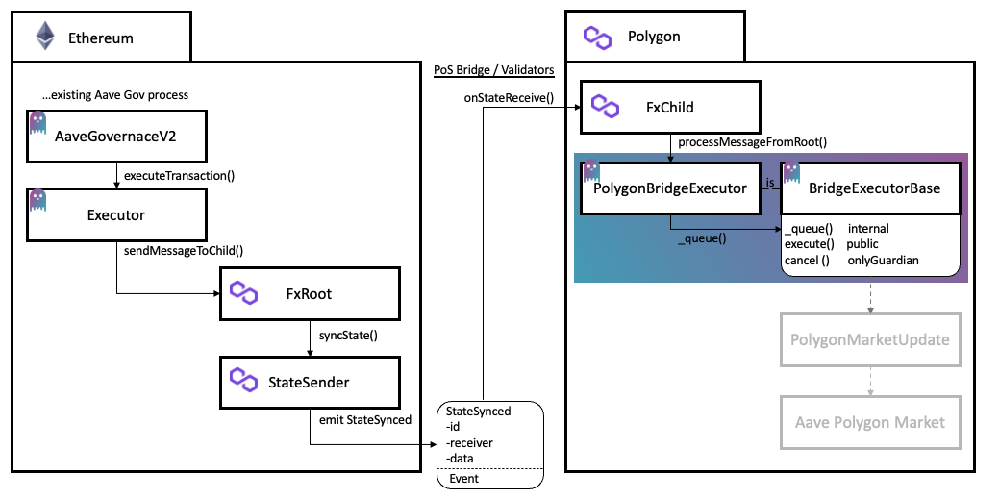
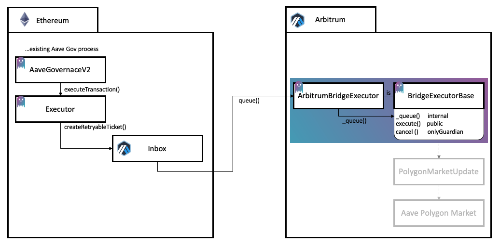

```
        .///.                .///.     //.            .//  `/////////////-
       `++:++`              .++:++`    :++`          `++:  `++:......---.`
      `/+: -+/`            `++- :+/`    /+/         `/+/   `++.
      /+/   :+/            /+:   /+/    `/+/        /+/`   `++.
  -::/++::`  /+:       -::/++::` `/+:    `++:      :++`    `++/:::::::::.
  -:+++::-`  `/+:      --++/---`  `++-    .++-    -++.     `++/:::::::::.
   -++.       .++-      -++`       .++.    .++.  .++-      `++.
  .++-         -++.    .++.         -++.    -++``++-       `++.
 `++:           :++`  .++-           :++`    :+//+:        `++:----------`
 -/:             :/-  -/:             :/.     ://:         `/////////////-
```

# Aave Crosschain Bridges

This repo contains smart contracts and related code for Aave cross-chain bridges. This is intended to extend Aave governance on Ethereum to other networks. This repo currently contains contracts to support bridging to Polygon and Arbitrum.

The core contract is the `BridgeExecutorBase`, an abstract contract that contains the logic to facilitate the queueing, delay, and execution of sets of actions on downstream networks. This base contract needs to be extended with functionality required for cross-chain transactions on a specific downstream network. In this repo, the base contract is extended for Polygon and Arbitrum.

The `BridgeExecutorBase` contract is implemented to facilitate the execution of sets of actions on other chains, after approval through Aave's governance process on Ethereum. Once the Ethereum governance process is completed, a cross-chain transaction can queue sets of actions for execution on the downstream chain. Once queued, these actions must wait for a certain `delay` prior to being executed. During the delay period a `guardian` address has the power to cancel the execution of these actions. If the delay period passes and the actions are not cancelled, the actions can be executed by anyone on the downstream chain.

The `BridgeExecutorBase` is abstract and intentionally leaves the `_queue` function internal. This requires another contract to extend the `BridgeExecutorBase` to handle network specific logic, cross-chain transaction validation, and permissioning, prior to calling the internal `_queue` function. 

## Audit
- MixBytes (8/12/21): [report](./audit/Aave-Governance-Crosschain-Bridges-Security-Audit-Report.pdf)

## Getting Started

### Setup

- Clone the repo
- run `npm install`

Follow the next steps to setup the repository:

- Install `docker` and `docker-compose`
- Create an environment file named `.env` and fill out the environment variables per `example.env`

### Running in Docker

Terminal Window 1
`docker-compose up`

Once Terminal Window 1 Loaded - in a seperate terminal window - Terminal Window 2: 
`docker-compose exec contracts-env bash`

In Terminal Window 2, run desired scripts from npm package file (i.e `npm run compile`)

### Compile

`npm run compile`

This will compile the available smart contracts.

## Polygon Governance Bridge 

### Polygon Governance Bridge Architecture



Additional documentation around the Polygon Bridging setup can be found at the links below:

- [Polygon Docs `L1<>L2 Communication`](https://docs.matic.network/docs/develop/l1-l2-communication/state-transfer)
- [FxPortal](https://github.com/jdkanani/fx-portal) 

### Test / Coverage

`npm run hardhat test` / `npm run hardhat coverage`

Run an end to end test of these contracts on an Ethereum mainnet fork. This makes the assumption that all contracts are on Ethereum, which is an inaccurate assumption but helps for testing smart contract functionality in one script.

The two assumption required to make this possible are:
1. Add a Call in the `CustomPolygonMapping` Contract. This way, rather than just emitting an event, and having a function called on Polygon, the receiver will be called directly with this function on the forked Eth Network.
2. In the `FxChild` the access control require statement in the first line of onStateReceive must be commented out because you cannot imitate that system address used in the polygon bridge.

### Execute Testnet Script

`npm run hardhat:goerli simulate-governance`

Assumes a `contractAddresses.json` file exists with all necessary contracts deployed and addresses with appropriate funding

The script will:

1. Create a proposal and wait for the voting to start (Proposal triggers a cross-chain message on execution)
2. Vote on the proposal and wait for the voting to end
3. Queue Vote and wait until execution time
4. Execute proposal
5. Monitor the Polygon Bridge for a queueing event
6. Try to immediately execute the transaction - Fail
7. Wait until execution time
8. Execute ActionsSet
9. Confirm expected Polygon state update

### Bridge Contracts Functionality
- The proposal is an encoded function call to the function `sendMessageToChild()` in `FxRoot`. The calldata for this proposal contains two encoded variables:
- The first variable is the address of the contract that will decode and process this message on the Polygon chain. In this case, the receiver is the `PolygonBridgeExecutor` contract address.
- The second variable is the data that will be decoded on the polygon chain. This field contains encoded bytes for the following fields targets[], values[], signatures[], calldatas[], and withDelegatecall[] 
- When the proposal is executed, `sendMessageToChild()` in the `FxRoot` triggers `syncState()` on the `StateSender` contract which emits a `StateSync` event. 
- Validators listening for this `StateSync` event then trigger the `onStateReceived()` in the `FxChild` contract on Polygon.
- In `onStateReceived` the encoded data is passed along to a contract that implements the function `processMessageFromRoot` - which in this case is in the `PolygonBridgeExecutor` contract. In `processMessageFromRoot` the `PolygonBridgeExecutor` calls `_queue()` in the `BridgeExecutorBese` contract to queue the proposed actions for the appropriate execution time

### Deploying the PolygonBridgeExecutor

- `fxRootSender` - the address that can send messages to this PolygonBridgeExecutor through the FxPortal. For Aave-Governance-V2 it is the executor contract.
- `fxChild` - the fxChild contract from the FxPortal
- `delay` - the time required to pass after the ActionsSet is queued, before execution
- `gracePeriod` - once execution time passes, you can execute this until the grace period ends
- `minimumDelay` - if the delay is updated by the guardian, it cannot be less than this minimum
- `maximumDelay` - if the delay is updated by the guardian, it cannot be more than this maximum
- `guardian` - the admin address of this contract with the permission to cancel ActionsSets and update the delay value

### PolygonBridge - FxPortal

This repo uses the [FxPortal](https://github.com/jdkanani/fx-portal) developed and designed by the Polygon team to support bridging from Ethereum to Polygon. The intent of the FxPortal is to help users avoid the step of registering their own sender and receiver contracts within Polygon's `StateSender` contract. The FxPortal contains two contracts - `FxRoot` and `FxChild`. The `FxRoot` contract has been deployed on Ethereum and the `FxChild` contract has been deployed on Polygon. The `FxRoot` contract is mapped to the `FxChild` contract via Polygon's `StateSender` contract on Ethereum. By calling the `sendMessageToChild(address _receiver, bytes calldata _data)` function in the `FxRoot`, the `msg.sender` is encoded, along with the provided `_receiver` and `_data`. This encoded message is sent to the `StateSender` contract and a `StateSynced` event is emitted with this data.

Polygon validators listen for `StateSynced` events from the `StateSender` - upon identifying one of these events from the `FxRoot`, they will call the function `onStateReceive(uint256 stateId, bytes calldata _data)` in `FxChild`. The encoded `data` message is decoded in `FxChild` and forwarded to the `receiver` contract via the function `processMessageFromRoot(stateId, rootMessageSender, data)`. The `rootMessageSender` that is passed along is the original `msg.sender` that called `FxRoot` which in this case is the Aave Governance Executor contract.

The `PolygonBridgeExecutor` implements the function `processMessageFromRoot(stateId, rootMessageSender, data);`. In this function, requiring that the `msg.sender` is the `FxChild` should ensure this is a legitimate transaction stemming from the ethereum bridge. By confirming that the `rootMessageSender` is the Aave governance executor contract, the `PolygonBridgeExecutor` can conclude this bridge transaction was triggered be the Aave Governance process and should in-fact be queued for execution.

### Examples of Upgradability

**Polygon Protocol Ownership Change**

In order to change the ownership of the Aave Polygon Market, the current owner must call `transferOwnership(address)` on Ownable contracts within the protocol. The address parameter provided to `transferOwnership(address)` should be the address of the deployed PolygonBridgeExecutor contract on Polygon. Once ownership of the Aave Polygon Market contracts is transferred to the PolygonBridgeExecutor, the PolygonBridgeExecutor will have the authorization to make updates to the Aave Polygon Market. Updates are only possible if they have completed the end-to-end, cross-chain governance process, passing Aave governance on Ethereum and going through the timelock on polygon without being cancelled.

In the future, if a change is needed in the PolygonBridgeExecutor contract, a new version can be deployed, and `transferOwnership(address)` should be called on Ownable contracts within the Aave Polygon Market, through the original version of the PolygonBridgeExecutor contract in order to pass ownership to the new PolygonBridgeExecutor version.

**Aave Governance Executor Update**

Aave's governance contracts on Ethereum are upgradable and because the PolygonBridgeExecutor is dependent on knowing the address of the Aave Governance Executor contract on ethereum, the PolygonBridgeExecutor will also have to be updated as part of this upgrade.

In order to update the PolygonBridgeExecutor - the function `updateFxRootSender(address)` should be called on the PolygonBridgeExecutor. This function should be executed via the cross-chain governance process using the original Aave Governance Executor. A proposal should be created on the ethereum based Aave goverance, once passed and executed, the transaction will be send to the PolygonBridgeExecutor contract. Once queued and exectued, the PolygonBridgeExecutor will call `updateFxRootSender(address)` on itself and updated the expected Aave Governance Executor address. Once that transaction executes, the PolygonBridgeExecutor will only queue ActionsSets that originate from the new Aave Governance Executor.

## Arbitrum Governance Bridge Architecture



Additional documentation around the Polygon Bridging setup can be found at the links below:

- [Arbitrum Docs `Messaging Between Layers`](https://developer.offchainlabs.com/docs/l1_l2_messages)
- [Inside Arbitrum `Bridging`](https://github.com/jdkanani/fx-portal) 

### Arbitrum Bridge Contracts Functionality

After going through the Aave governance, the proposal payload will be a call to the following function in the Arbitrum Inbox contract on Ethereum:

```
 /**
    @notice Put an message in the L2 inbox that can be re-executed for some fixed amount of time if it reverts
    * @dev all msg.value will deposited to callValueRefundAddress on L2
    * @param destAddr destination L2 contract address
    * @param l2CallValue call value for retryable L2 message
    * @param  maxSubmissionCost Max gas deducted from user's L2 balance to cover base submission fee
    * @param excessFeeRefundAddress maxGas x gasprice - execution cost gets credited here on L2 balance
    * @param callValueRefundAddress l2Callvalue gets credited here on L2 if retryable txn times out or gets cancelled
    * @param maxGas Max gas deducted from user's L2 balance to cover L2 execution
    * @param gasPriceBid price bid for L2 execution
    * @param data ABI encoded data of L2 message
    * @return unique id for retryable transaction (keccak256(requestID, uint(0) )
     */
    function createRetryableTicket(
        address destAddr,
        uint256 l2CallValue,
        uint256 maxSubmissionCost,
        address excessFeeRefundAddress,
        address callValueRefundAddress,
        uint256 maxGas,
        uint256 gasPriceBid,
        bytes calldata data
    ) external payable override returns (uint256)
```

From the function above, the key (non-gas related) bridging fields are `destAddr`, `data`, and `l2CallValue`. `destAddr` is the contract that will be called on Arbitrum. In this case it is the `ArbitrumBridgeExecutor` contract. The `data` is the encoded data for the cross chain transaction. In this case the `data` should be the encoded data for `queue(targets, values, signatures, calldatas, withDelegatecalls)`. `l2CallValue` is what will be sent over as the `msg.value` on L2. The rest of the fields pertain to gas management on Arbitrum and should be defined per Arbitrum documentation.
 
When this transaction is sent cross-chain, the `msg.sender` that send the message to the Arbitrum Inbox is retained. This means that the Aave governance executor contract will be the `msg.sender` when the `ArbitrumBridgeExecutor` is called on Arbitrum. For this reason, the Aave governance executor contract address should be provided to the `ArbitrumBridgeExecutor` contract in the constructor. This address will be saved and used to permission the queue function so that only calls from this address can successfully queue the ActionsSet in the `BridgeExecutorBase`.

### Deploying the ArbitrumBridgeExecutor

- `ethereumGovernanceExecutor` - the address that will have permission to queue ActionSets. This should be the aave governance executor
- `delay` - the time required to pass after the ActionsSet is queued, before execution
- `gracePeriod` - once execution time passes, you can execute this until the grace period ends
- `minimumDelay` - if the delay is updated by the guardian, it cannot be less than this minimum
- `maximumDelay` - if the delay is updated by the guardian, it cannot be more than this maximum
- `guardian` - the admin address of this contract with the permission to cancel ActionsSets and update the delay value


## Additional Available Tasks

- `get-info` - this will print current chain info: ChainId, Current Block, Balance of a hardcoded address
- `print-default-wallets` - print the wallets available based on the .env secrets
- `deploy` - generic deployment task
- `verify` - verifies contract on Etherscan
- `verify-template` - template verification helper

Note:

When using the tasks through `npm run hardhat <taskname>` if you are including options you will need to include and extra -- prior to the task options. Example of task with options:

```
npm run hardhat deploy -- --contract Greeter --printparams
```

### deploy

Usage: hardhat [GLOBAL OPTIONS] deploy --contract <STRING> --libraries <STRING> --librariesfile <STRING> --params <STRING> --paramsfile <STRING> [--printparams] --signer <STRING> [--verify]

OPTIONS:

  --contract     	Name of contract to deploy
  --libraries    	json as string mapping of libraries to address
  --librariesfile	file containing mapping of libraries to address
  --params       	JSON string of contract params - defaults to CLI
  --paramsfile   	Path to a TS file with params defined as default export
  --printparams  	Print constructor params
  --signer       	Define signer - private key(pk), mnemonic(mn), defender(ozd) - defaults to ethers signer
  --verify       	Verify contract on Etherscan

deploy: deploy contract - add contract name and params as arguements

The parameters for the contract constructor can be set four different ways:
1. use the option `--params` as a stringified JSON
2. use the option `--paramsfile` to define the path to a ts file that has the parameters as the default export
2. hardcode the params as a JSON in the contractparams variable in the deploy task
    - you can use the --printparams option to get a template JSON of the params to copy and paste into the script and fill out 
3. use the cli. By not setting contractparams you can 

To include the contract params as a string, pay close attentions to the quotations used to create the stringified JSON object. Below is a working example:

```
npm run hardhat deploy -- --contract Greeter --params '{"_greeting": "asdf","_testNumber": 12, "_testAddress": "0x3619DbE27d7c1e7E91aA738697Ae7Bc5FC3eACA5"}'
```

Example using --paramsfile
```
npm run hardhat deploy -- --contract Greeter --paramsfile ./greeterParams.ts
```

## verify-template

Usage: hardhat [GLOBAL OPTIONS] verify-template --contract <STRING> --contractaddress <STRING> --libraries <STRING> --librariesfile <STRING> --params <STRING> --paramsfile <STRING> [--printparams]

OPTIONS:

  --contract       	Name of contract to deploy
  --contractaddress	Address of deployed contract to verify
  --libraries      	json as string mapping of libraries to address
  --librariesfile  	file containing mapping of libraries to address
  --params         	JSON string of contract params - defaults to CLI
  --paramsfile     	Path to a TS file with params defined as default export
  --printparams    	Print constructor params

verify-template: verify contract on etherscan

This wraps the default 'verify' task to enable some flexibility in how params and libraries are provided.
